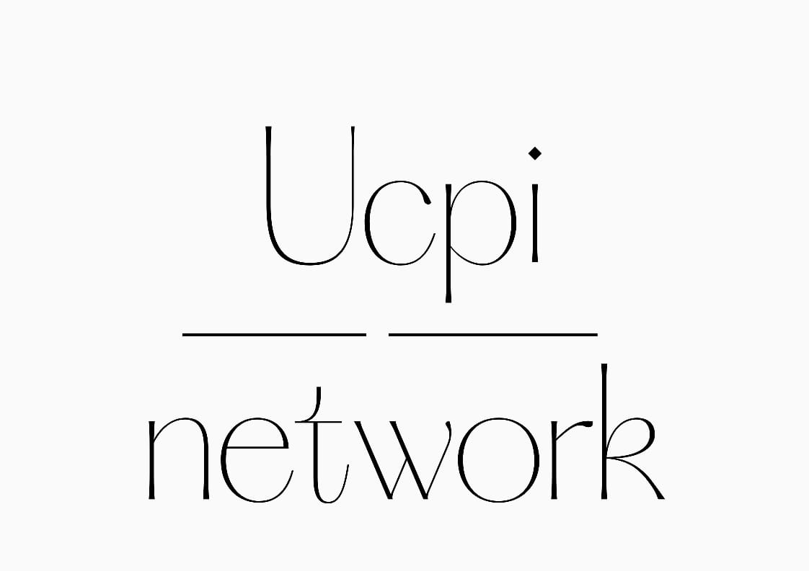

<div align="center">
  
[](https://github.com/ucpilabs/ucpiNetwork/releases/tag/v1.3.1)
[](https://www.gnu.org/licenses/agpl-3.0) [](CODE_OF_CONDUCT.md)
<a href="https://twitter.com/intent/follow?screen_name=ucpiNetwork">
</a>

 </div>

ucpi Network offers scalable permissionless smart contracts with a private by default design— bringing novel use cases to blockchain not feasible on public systems. ucpi Network enables users to take back ownership over their private (financial) information and for them to share this information with whom they trust. ucpi Network was the first protocol to provide private smart contracts on mainnet, live since September 2020. ucpi Network is Built with the Cosmos Software Development Kit (SDK) bringing Interoperable privacy to the entire Cosmos ecosystem. ucpi Network uses a combination of the Intel SGX (Software Guard Extension) Trusted Execution Environment technology, several encryption schemes and key management to bring privacy by default to blockchain users. ucpi Contracts are an implementation of the Rust based smart contract compiling toolkit CosmWasm, adding private metadata possibilities. ucpi Network is powered by the Native public coin ucpi which is used for fees, Proof Of Stake security and Governance. With more than 20+ Dapps, 100+ full time builders and a strong grassroots community ucpi Network aims to bring privacy to the masses.


# Setting up Environment

## Prebuilt Environment

### Gitpod

Click the button below to start a new development environment:

[](https://gitpod.io/#https://github.com/ucpilabs/ucpiNetwork)

### VSCode Docker Environment

1. Install <vs code remote> extension

2. Clone this repository into a new dev container

### Docker Dev Environments

1. From Docker Desktop, create a new Dev Environment from the prebuilt image - `ghcr.io/ucpilabs/ucpinetwork-dev:latest`
2. Connect with VSCode, or use the container directly
3. Make sure the code is updated by using `get fetch` and `git pull`

## Manual Set up

### Clone Repo

Clone this repo to your favorite working directory

### Install Rust

Install rust from [https://rustup.rs/](https://rustup.rs/). 

Then, add the rust-src component. This will also install the version of rust that is defined by the workspace (in `rust-toolchain`) - `rustup component add rust-src`

To run tests you'll need to add the wasm32 target - `rustup target add wasm32-unknown-unknown`

### Install Go

Install go from [https://go.dev/doc/install](https://go.dev/doc/install)

### Install SGX

To compile the code and run tests, you'll need to install the SGX SDK and PSW. To run in simulation (or software) modes of SGX you do _not_ need to install the SGX driver. 
For a simple install, run the [install-sgx.sh](./scripts/install-sgx.sh) script in the following way:

`sudo ./scripts/install-sgx.sh true true true false`

# Build from Source

Use `make build-linux` to build the entire codebase. This will build both the Rust (enclave & contract engine) and the Go (blockchain) code.

To build just the rust code, you can use `make _build-linux`, while to build just the Go code, there is the aptly named `make build_local_no_rust`.


Tip:
```text
For a production build the enclave must be copied from the most recent release. 

This is due to non-reproducible builds, and the fact that enclaves must be signed with a specific key to be accepted on mainnet. 

Still, the non-enclave code can be modified and ran on mainnet as long as there are no consensus-breaking changes
```

# Running Something

## Run tests

To build run all tests, use `make go-tests`

## Start local network

Run `./scripts/start-node.sh`

# Documentation

For the latest documentation, check out [https://docs.ucpi.network](https://docs.ucpi.network)

# Community

- Homepage: [https://ucpi.network](https://ucpi.network)
- Blog: [https://blog.ucpi.network](https://blog.ucpi.network)
- Forum: [https://forum.ucpi.network](https://forum.ucpi.network)
- Docs: [https://docs.ucpi.network](https://docs.ucpi.network)
- Discord: [https://chat.ucpi.network](https://chat.ucpi.network)
- Twitter: [https://twitter.com/ucpiNetwork](https://twitter.com/ucpiNetwork)
- Community Telegram Channel: [https://t.me/ucpinetwork](https://t.me/ucpinetwork)
- Community ucpi Nodes Telegram: [https://t.me/ucpinodes](https://t.me/ucpinodes)

# License

ucpiNetwork is free software: you can redistribute it and/or modify it under the terms of the [GNU Affero General Public License](LICENSE) as published by the Free Software Foundation, either version 3 of the License, or (at your option) any later version. The GNU Affero General Public License is based on the GNU GPL, but has an additional term to allow users who interact with the licensed software over a network to receive the source for that program.
